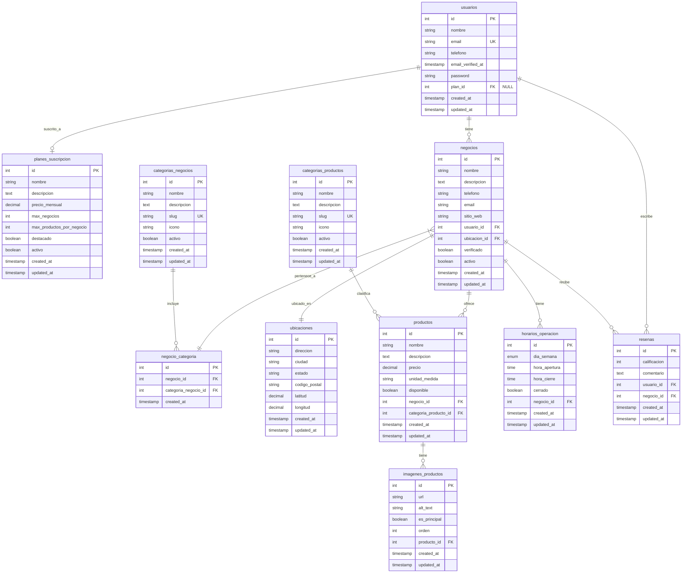

# Diagrama de Entidad-Relación (ERD) - Marketplace Informativo

## Descripción de Relaciones

### **1. USUARIOS → PLANES_SUSCRIPCION**
- **Tipo**: Uno a Uno (Opcional)
- **Cardinalidad**: `usuarios ||--o| planes_suscripcion`
- **Descripción**: Un usuario puede tener un plan de suscripción, pero puede existir sin plan (plan gratuito)

### **2. USUARIOS → NEGOCIOS**
- **Tipo**: Uno a Muchos
- **Cardinalidad**: `usuarios ||--o{ negocios`
- **Descripción**: Un usuario puede tener múltiples negocios (según su plan)

### **3. USUARIOS → RESEÑAS**
- **Tipo**: Uno a Muchos
- **Cardinalidad**: `usuarios ||--o{ resenas`
- **Descripción**: Un usuario puede escribir múltiples reseñas

### **4. NEGOCIOS → UBICACIONES**
- **Tipo**: Uno a Uno
- **Cardinalidad**: `negocios ||--|| ubicaciones`
- **Descripción**: Cada negocio tiene exactamente una ubicación física

### **5. NEGOCIOS → PRODUCTOS**
- **Tipo**: Uno a Muchos
- **Cardinalidad**: `negocios ||--o{ productos`
- **Descripción**: Un negocio puede ofrecer múltiples productos

### **6. NEGOCIOS → HORARIOS_OPERACION**
- **Tipo**: Uno a Muchos
- **Cardinalidad**: `negocios ||--o{ horarios_operacion`
- **Descripción**: Un negocio tiene horarios para cada día de la semana

### **7. NEGOCIOS → RESEÑAS**
- **Tipo**: Uno a Muchos
- **Cardinalidad**: `negocios ||--o{ resenas`
- **Descripción**: Un negocio puede recibir múltiples reseñas

### **8. NEGOCIOS ↔ CATEGORIAS_NEGOCIOS (Tabla Pivote)**
- **Tipo**: Muchos a Muchos
- **Cardinalidad**: `negocios }|--|| negocio_categoria` y `categorias_negocios ||--o{ negocio_categoria`
- **Descripción**: Un negocio puede pertenecer a múltiples categorías y una categoría puede incluir múltiples negocios

### **9. CATEGORIAS_PRODUCTOS → PRODUCTOS**
- **Tipo**: Uno a Muchos
- **Cardinalidad**: `categorias_productos ||--o{ productos`
- **Descripción**: Una categoría puede clasificar múltiples productos

### **10. PRODUCTOS → IMAGENES_PRODUCTOS**
- **Tipo**: Uno a Muchos
- **Cardinalidad**: `productos ||--o{ imagenes_productos`
- **Descripción**: Un producto puede tener múltiples imágenes

## Claves y Restricciones

### **Claves Primarias (PK)**
- Todas las tablas tienen un campo `id` como clave primaria autoincremental

### **Claves Foráneas (FK)**
- `usuarios.plan_id` → `planes_suscripcion.id`
- `negocios.usuario_id` → `usuarios.id`
- `negocios.ubicacion_id` → `ubicaciones.id`
- `negocio_categoria.negocio_id` → `negocios.id`
- `negocio_categoria.categoria_negocio_id` → `categorias_negocios.id`
- `productos.negocio_id` → `negocios.id`
- `productos.categoria_producto_id` → `categorias_productos.id`
- `imagenes_productos.producto_id` → `productos.id`
- `horarios_operacion.negocio_id` → `negocios.id`
- `resenas.usuario_id` → `usuarios.id`
- `resenas.negocio_id` → `negocios.id`

### **Claves Únicas (UK)**
- `usuarios.email`
- `categorias_negocios.slug`
- `categorias_productos.slug`

### **Restricciones Adicionales**
- `resenas.calificacion`: Entre 1 y 5
- `horarios_operacion.dia_semana`: ENUM ('lunes', 'martes', 'miércoles', 'jueves', 'viernes', 'sábado', 'domingo')
- `imagenes_productos.orden`: Para ordenamiento de imágenes
- Índices únicos compuestos en tabla pivote: (`negocio_id`, `categoria_negocio_id`)

## Características del Modelo

### **Escalabilidad**
- Separación clara de responsabilidades
- Tablas pivote para relaciones muchos a muchos
- Campos de timestamps para auditoría

### **Flexibilidad**
- Sistema de categorías extensible
- Múltiples imágenes por producto
- Horarios personalizables por día

### **Integridad Referencial**
- Todas las relaciones tienen claves foráneas definidas
- Restricciones de unicidad donde corresponde
- Validaciones a nivel de base de datos

### **Performance**
- Índices en claves foráneas
- Slugs para URLs amigables
- Campos boolean para filtros rápidos