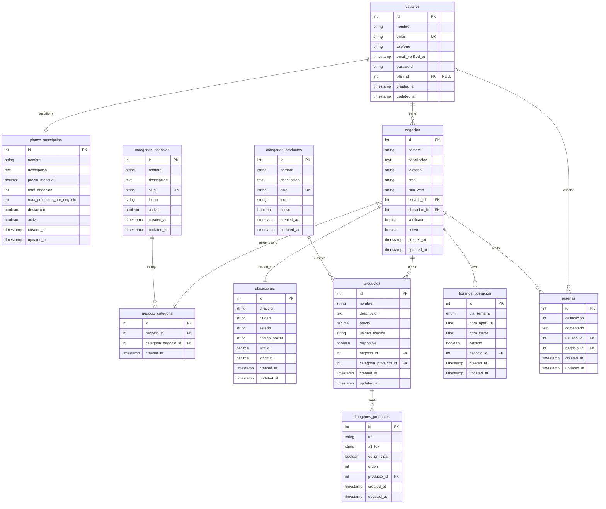

# Modelo de Datos para Marketplace Informativo

## 1. Descripción General

Este documento presenta el modelo de datos completo para una plataforma web tipo marketplace (similar a MercadoLibre) con las siguientes características:

- Plataforma de exhibición de productos SIN funcionalidad de venta/compra directa
- Negocios locales pueden registrarse y subir sus productos
- Los usuarios pueden navegar y ver información de productos y tiendas
- No hay transacciones monetarias en la plataforma
- Sistema de planes de suscripción: gratis, pro y premium

## 2. Diagrama Entidad-Relación (ERD)



## 3. Definición de Tablas

A continuación se detalla el script SQL para la creación de las tablas del modelo de datos:

```sql
-- ====================================================================
-- MARKETPLACE DATABASE SCHEMA - MySQL 8.0
-- Sistema de marketplace multi-negocio con suscripciones
-- ====================================================================

-- 1. TABLA: usuarios
-- Propósito: Almacena información de usuarios del sistema (clientes y dueños de negocios)
CREATE TABLE usuarios (
    id BIGINT UNSIGNED PRIMARY KEY AUTO_INCREMENT,
    uuid CHAR(36) NOT NULL UNIQUE DEFAULT (UUID()),
    email VARCHAR(255) NOT NULL UNIQUE,
    email_verified_at TIMESTAMP NULL,
    password VARCHAR(255) NOT NULL,
    nombre VARCHAR(100) NOT NULL,
    apellido VARCHAR(100) NOT NULL,
    telefono VARCHAR(20),
    fecha_nacimiento DATE,
    genero ENUM('M', 'F', 'O') COMMENT 'M=Masculino, F=Femenino, O=Otro',
    avatar TEXT,
    tipo_usuario ENUM('cliente', 'negocio') NOT NULL DEFAULT 'cliente',
    estado ENUM('activo', 'suspendido', 'eliminado') NOT NULL DEFAULT 'activo',
    fecha_registro TIMESTAMP NOT NULL DEFAULT CURRENT_TIMESTAMP,
    ultimo_acceso TIMESTAMP NULL,
    created_at TIMESTAMP DEFAULT CURRENT_TIMESTAMP,
    updated_at TIMESTAMP DEFAULT CURRENT_TIMESTAMP ON UPDATE CURRENT_TIMESTAMP,
    
    -- Índices optimizados
    INDEX idx_email (email),
    INDEX idx_tipo_usuario (tipo_usuario),
    INDEX idx_estado (estado),
    INDEX idx_fecha_registro (fecha_registro),
    INDEX idx_uuid (uuid),
    
    -- Constraints
    CONSTRAINT chk_email_format CHECK (email REGEXP '^[A-Za-z0-9._%+-]+@[A-Za-z0-9.-]+\.[A-Za-z]{2,}$'),
    CONSTRAINT chk_telefono_format CHECK (telefono IS NULL OR telefono REGEXP '^[+]?[0-9]{8,15}$')
) ENGINE=InnoDB DEFAULT CHARSET=utf8mb4 COLLATE=utf8mb4_unicode_ci;

-- 2. TABLA: planes_suscripcion
-- Propósito: Define los planes de suscripción disponibles para los negocios
CREATE TABLE planes_suscripcion (
    id INT UNSIGNED PRIMARY KEY AUTO_INCREMENT,
    nombre VARCHAR(50) NOT NULL UNIQUE,
    descripcion TEXT,
    precio_mensual DECIMAL(10,2) NOT NULL,
    precio_anual DECIMAL(10,2),
    max_productos INT UNSIGNED NOT NULL DEFAULT 0 COMMENT '0 = ilimitado',
    max_imagenes_producto TINYINT UNSIGNED NOT NULL DEFAULT 5,
    permite_promociones BOOLEAN NOT NULL DEFAULT FALSE,
    permite_estadisticas_avanzadas BOOLEAN NOT NULL DEFAULT FALSE,
    soporte_prioritario BOOLEAN NOT NULL DEFAULT FALSE,
    comision_transaccion DECIMAL(5,4) NOT NULL DEFAULT 0.0300 COMMENT 'Porcentaje como decimal (3% = 0.03)',
    activo BOOLEAN NOT NULL DEFAULT TRUE,
    orden_display TINYINT UNSIGNED NOT NULL DEFAULT 1,
    caracteristicas JSON COMMENT 'Lista de características incluidas',
    created_at TIMESTAMP DEFAULT CURRENT_TIMESTAMP,
    updated_at TIMESTAMP DEFAULT CURRENT_TIMESTAMP ON UPDATE CURRENT_TIMESTAMP,
    
    -- Índices
    INDEX idx_activo (activo),
    INDEX idx_orden_display (orden_display),
    INDEX idx_precio_mensual (precio_mensual),
    
    -- Constraints
    CONSTRAINT chk_precio_mensual_positive CHECK (precio_mensual >= 0),
    CONSTRAINT chk_precio_anual_positive CHECK (precio_anual IS NULL OR precio_anual >= 0),
    CONSTRAINT chk_comision_valid CHECK (comision_transaccion >= 0 AND comision_transaccion <= 1)
) ENGINE=InnoDB DEFAULT CHARSET=utf8mb4 COLLATE=utf8mb4_unicode_ci;

-- 3. TABLA: negocios
-- Propósito: Almacena información de los negocios registrados en el marketplace
CREATE TABLE negocios (
    id BIGINT UNSIGNED PRIMARY KEY AUTO_INCREMENT,
    usuario_id BIGINT UNSIGNED NOT NULL,
    plan_suscripcion_id INT UNSIGNED NOT NULL,
    uuid CHAR(36) NOT NULL UNIQUE DEFAULT (UUID()),
    nombre VARCHAR(150) NOT NULL,
    slug VARCHAR(150) NOT NULL UNIQUE,
    descripcion TEXT,
    logo TEXT,
    banner TEXT,
    telefono VARCHAR(20),
    email_contacto VARCHAR(255),
    sitio_web VARCHAR(255),
    whatsapp VARCHAR(20),
    instagram VARCHAR(100),
    facebook VARCHAR(100),
    
    -- Información de suscripción
    fecha_suscripcion TIMESTAMP NOT NULL DEFAULT CURRENT_TIMESTAMP,
    fecha_vencimiento_suscripcion DATE NOT NULL,
    estado_suscripcion ENUM('activa', 'vencida', 'suspendida', 'cancelada') NOT NULL DEFAULT 'activa',
    
    -- Estados y configuración
    estado ENUM('borrador', 'pendiente', 'activo', 'suspendido', 'eliminado') NOT NULL DEFAULT 'borrador',
    verificado BOOLEAN NOT NULL DEFAULT FALSE,
    fecha_verificacion TIMESTAMP NULL,
    
    -- Configuraciones del negocio
    acepta_pedidos BOOLEAN NOT NULL DEFAULT TRUE,
    tiempo_preparacion_min INT UNSIGNED DEFAULT 30 COMMENT 'Tiempo en minutos',
    metodos_pago JSON COMMENT 'Array de métodos de pago aceptados',
    
    -- Metadatos de SEO
    meta_title VARCHAR(200),
    meta_description VARCHAR(300),
    
    created_at TIMESTAMP DEFAULT CURRENT_TIMESTAMP,
    updated_at TIMESTAMP DEFAULT CURRENT_TIMESTAMP ON UPDATE CURRENT_TIMESTAMP,
    
    -- Claves foráneas
    FOREIGN KEY (usuario_id) REFERENCES usuarios(id) ON DELETE RESTRICT ON UPDATE CASCADE,
    FOREIGN KEY (plan_suscripcion_id) REFERENCES planes_suscripcion(id) ON DELETE RESTRICT ON UPDATE CASCADE,
    
    -- Índices optimizados
    INDEX idx_usuario_id (usuario_id),
    INDEX idx_plan_suscripcion_id (plan_suscripcion_id),
    INDEX idx_slug (slug),
    INDEX idx_estado (estado),
    INDEX idx_estado_suscripcion (estado_suscripcion),
    INDEX idx_fecha_vencimiento (fecha_vencimiento_suscripcion),
    INDEX idx_verificado (verificado),
    INDEX idx_acepta_pedidos (acepta_pedidos),
    INDEX idx_uuid (uuid),
    
    -- Constraints
    CONSTRAINT chk_slug_format CHECK (slug REGEXP '^[a-z0-9-]+$'),
    CONSTRAINT chk_email_contacto_format CHECK (email_contacto IS NULL OR email_contacto REGEXP '^[A-Za-z0-9._%+-]+@[A-Za-z0-9.-]+\.[A-Za-z]{2,}$'),
    CONSTRAINT chk_sitio_web_format CHECK (sitio_web IS NULL OR sitio_web REGEXP '^https?://'),
    CONSTRAINT chk_tiempo_preparacion CHECK (tiempo_preparacion_min IS NULL OR tiempo_preparacion_min > 0)
) ENGINE=InnoDB DEFAULT CHARSET=utf8mb4 COLLATE=utf8mb4_unicode_ci;

-- 4. TABLA: categorias_negocios
-- Propósito: Categorización de negocios (restaurantes, tiendas, servicios, etc.)
CREATE TABLE categorias_negocios (
    id INT UNSIGNED PRIMARY KEY AUTO_INCREMENT,
    nombre VARCHAR(100) NOT NULL UNIQUE,
    slug VARCHAR(100) NOT NULL UNIQUE,
    descripcion TEXT,
    icono VARCHAR(50) COMMENT 'Nombre del icono o clase CSS',
    color VARCHAR(7) COMMENT 'Color hex para UI',
    imagen TEXT,
    activo BOOLEAN NOT NULL DEFAULT TRUE,
    orden_display INT UNSIGNED NOT NULL DEFAULT 1,
    meta_title VARCHAR(200),
    meta_description VARCHAR(300),
    created_at TIMESTAMP DEFAULT CURRENT_TIMESTAMP,
    updated_at TIMESTAMP DEFAULT CURRENT_TIMESTAMP ON UPDATE CURRENT_TIMESTAMP,
    
    -- Índices
    INDEX idx_slug (slug),
    INDEX idx_activo (activo),
    INDEX idx_orden_display (orden_display),
    
    -- Constraints
    CONSTRAINT chk_slug_format CHECK (slug REGEXP '^[a-z0-9-]+$'),
    CONSTRAINT chk_color_hex CHECK (color IS NULL OR color REGEXP '^#[0-9A-Fa-f]{6}$')
) ENGINE=InnoDB DEFAULT CHARSET=utf8mb4 COLLATE=utf8mb4_unicode_ci;

-- Tabla de relación muchos a muchos entre negocios y categorías
CREATE TABLE negocio_categoria (
    negocio_id BIGINT UNSIGNED,
    categoria_negocio_id INT UNSIGNED,
    PRIMARY KEY (negocio_id, categoria_negocio_id),
    FOREIGN KEY (negocio_id) REFERENCES negocios(id) ON DELETE CASCADE ON UPDATE CASCADE,
    FOREIGN KEY (categoria_negocio_id) REFERENCES categorias_negocios(id) ON DELETE CASCADE ON UPDATE CASCADE
) ENGINE=InnoDB DEFAULT CHARSET=utf8mb4 COLLATE=utf8mb4_unicode_ci;

-- 5. TABLA: categorias_productos
-- Propósito: Categorización de productos dentro de cada negocio
CREATE TABLE categorias_productos (
    id BIGINT UNSIGNED PRIMARY KEY AUTO_INCREMENT,
    negocio_id BIGINT UNSIGNED NOT NULL,
    nombre VARCHAR(100) NOT NULL,
    slug VARCHAR(100) NOT NULL,
    descripcion TEXT,
    imagen TEXT,
    activo BOOLEAN NOT NULL DEFAULT TRUE,
    orden_display INT UNSIGNED NOT NULL DEFAULT 1,
    created_at TIMESTAMP DEFAULT CURRENT_TIMESTAMP,
    updated_at TIMESTAMP DEFAULT CURRENT_TIMESTAMP ON UPDATE CURRENT_TIMESTAMP,
    
    -- Claves foráneas
    FOREIGN KEY (negocio_id) REFERENCES negocios(id) ON DELETE CASCADE ON UPDATE CASCADE,
    
    -- Índices
    INDEX idx_negocio_id (negocio_id),
    INDEX idx_slug_negocio (negocio_id, slug),
    INDEX idx_activo (activo),
    INDEX idx_orden_display (orden_display),
    
    -- Constraints
    UNIQUE KEY unique_slug_per_business (negocio_id, slug),
    CONSTRAINT chk_slug_format CHECK (slug REGEXP '^[a-z0-9-]+$')
) ENGINE=InnoDB DEFAULT CHARSET=utf8mb4 COLLATE=utf8mb4_unicode_ci;

-- 6. TABLA: ubicaciones
-- Propósito: Almacena ubicaciones geográficas de negocios para delivery y pickup
CREATE TABLE ubicaciones (
    id BIGINT UNSIGNED PRIMARY KEY AUTO_INCREMENT,
    negocio_id BIGINT UNSIGNED NOT NULL,
    tipo ENUM('principal', 'sucursal') NOT NULL DEFAULT 'principal',
    nombre VARCHAR(100) COMMENT 'Nombre de la sucursal',
    direccion TEXT NOT NULL,
    ciudad VARCHAR(100) NOT NULL,
    estado VARCHAR(100),
    codigo_postal VARCHAR(20),
    pais VARCHAR(100) NOT NULL DEFAULT 'México',
    
    -- Coordenadas geográficas
    latitud DECIMAL(10,8),
    longitud DECIMAL(11,8),
    
    -- Configuraciones de entrega
    acepta_delivery BOOLEAN NOT NULL DEFAULT TRUE,
    acepta_pickup BOOLEAN NOT NULL DEFAULT TRUE,
    radio_delivery_km DECIMAL(5,2) DEFAULT 10.00,
    costo_delivery DECIMAL(8,2) DEFAULT 0.00,
    delivery_gratis_desde DECIMAL(10,2) COMMENT 'Monto mínimo para envío gratis',
    
    activo BOOLEAN NOT NULL DEFAULT TRUE,
    created_at TIMESTAMP DEFAULT CURRENT_TIMESTAMP,
    updated_at TIMESTAMP DEFAULT CURRENT_TIMESTAMP ON UPDATE CURRENT_TIMESTAMP,
    
    -- Claves foráneas
    FOREIGN KEY (negocio_id) REFERENCES negocios(id) ON DELETE CASCADE ON UPDATE CASCADE,
    
    -- Índices geográficos y de búsqueda
    INDEX idx_negocio_id (negocio_id),
    INDEX idx_ciudad (ciudad),
    INDEX idx_activo (activo),
    INDEX idx_tipo (tipo),
    SPATIAL INDEX idx_coordenadas (latitud, longitud) COMMENT 'Para búsquedas geográficas',
    INDEX idx_acepta_delivery (acepta_delivery),
    INDEX idx_acepta_pickup (acepta_pickup),
    
    -- Constraints
    CONSTRAINT chk_latitud_valid CHECK (latitud IS NULL OR (latitud >= -90 AND latitud <= 90)),
    CONSTRAINT chk_longitud_valid CHECK (longitud IS NULL OR (longitud >= -180 AND longitud <= 180)),
    CONSTRAINT chk_radio_delivery_positive CHECK (radio_delivery_km IS NULL OR radio_delivery_km > 0),
    CONSTRAINT chk_costo_delivery_positive CHECK (costo_delivery >= 0),
    CONSTRAINT chk_delivery_gratis_positive CHECK (delivery_gratis_desde IS NULL OR delivery_gratis_desde > 0)
) ENGINE=InnoDB DEFAULT CHARSET=utf8mb4 COLLATE=utf8mb4_unicode_ci;

-- 7. TABLA: productos
-- Propósito: Catálogo de productos/servicios que ofrecen los negocios
CREATE TABLE productos (
    id BIGINT UNSIGNED PRIMARY KEY AUTO_INCREMENT,
    negocio_id BIGINT UNSIGNED NOT NULL,
    categoria_producto_id BIGINT UNSIGNED,
    uuid CHAR(36) NOT NULL UNIQUE DEFAULT (UUID()),
    nombre VARCHAR(200) NOT NULL,
    slug VARCHAR(200) NOT NULL,
    descripcion TEXT,
    descripcion_corta VARCHAR(300),
    
    -- Precios y disponibilidad
    precio DECIMAL(10,2) NOT NULL,
    precio_oferta DECIMAL(10,2),
    fecha_inicio_oferta TIMESTAMP NULL,
    fecha_fin_oferta TIMESTAMP NULL,
    
    -- Inventario y stock
    maneja_inventario BOOLEAN NOT NULL DEFAULT FALSE,
    stock BIGINT UNSIGNED DEFAULT 0,
    stock_minimo INT UNSIGNED DEFAULT 0,
    peso_gramos INT UNSIGNED COMMENT 'Para cálculo de envío',
    
    -- Estados y configuración
    disponible BOOLEAN NOT NULL DEFAULT TRUE,
    destacado BOOLEAN NOT NULL DEFAULT FALSE,
    requiere_preparacion BOOLEAN NOT NULL DEFAULT FALSE,
    tiempo_preparacion_min INT UNSIGNED COMMENT 'Tiempo adicional de preparación',
    
    -- Variantes y opciones
    tiene_variantes BOOLEAN NOT NULL DEFAULT FALSE,
    opciones_personalizacion JSON COMMENT 'Configuraciones personalizables',
    
    -- SEO y metadatos
    meta_title VARCHAR(200),
    meta_description VARCHAR(300),
    keywords VARCHAR(500),
    
    -- Estadísticas
    vistas BIGINT UNSIGNED NOT NULL DEFAULT 0,
    ventas BIGINT UNSIGNED NOT NULL DEFAULT 0,
    orden_display INT UNSIGNED NOT NULL DEFAULT 1,
    
    created_at TIMESTAMP DEFAULT CURRENT_TIMESTAMP,
    updated_at TIMESTAMP DEFAULT CURRENT_TIMESTAMP ON UPDATE CURRENT_TIMESTAMP,
    
    -- Claves foráneas
    FOREIGN KEY (negocio_id) REFERENCES negocios(id) ON DELETE CASCADE ON UPDATE CASCADE,
    FOREIGN KEY (categoria_producto_id) REFERENCES categorias_productos(id) ON DELETE SET NULL ON UPDATE CASCADE,
    
    -- Índices optimizados para búsqueda y rendimiento
    INDEX idx_negocio_id (negocio_id),
    INDEX idx_categoria_producto_id (categoria_producto_id),
    INDEX idx_slug_negocio (negocio_id, slug),
    INDEX idx_disponible (disponible),
    INDEX idx_destacado (destacado),
    INDEX idx_precio (precio),
    INDEX idx_precio_oferta (precio_oferta),
    INDEX idx_fecha_ofertas (fecha_inicio_oferta, fecha_fin_oferta),
    INDEX idx_orden_display (orden_display),
    INDEX idx_vistas (vistas),
    INDEX idx_ventas (ventas),
    INDEX idx_uuid (uuid),
    
    -- Índice full-text para búsqueda
    FULLTEXT INDEX idx_search (nombre, descripcion, descripcion_corta, keywords),
    
    -- Constraints
    UNIQUE KEY unique_slug_per_business (negocio_id, slug),
    CONSTRAINT chk_precio_positive CHECK (precio >= 0),
    CONSTRAINT chk_precio_oferta_positive CHECK (precio_oferta IS NULL OR precio_oferta >= 0),
    CONSTRAINT chk_precio_oferta_menor CHECK (precio_oferta IS NULL OR precio_oferta < precio),
    CONSTRAINT chk_stock_positive CHECK (stock >= 0),
    CONSTRAINT chk_tiempo_preparacion_positive CHECK (tiempo_preparacion_min IS NULL OR tiempo_preparacion_min > 0),
    CONSTRAINT chk_slug_format CHECK (slug REGEXP '^[a-z0-9-]+$')
) ENGINE=InnoDB DEFAULT CHARSET=utf8mb4 COLLATE=utf8mb4_unicode_ci;

-- 8. TABLA: imagenes_productos
-- Propósito: Almacena múltiples imágenes por producto con orden de visualización
CREATE TABLE imagenes_productos (
    id BIGINT UNSIGNED PRIMARY KEY AUTO_INCREMENT,
    producto_id BIGINT UNSIGNED NOT NULL,
    url TEXT NOT NULL,
    titulo VARCHAR(200),
    descripcion VARCHAR(500),
    orden_display TINYINT UNSIGNED NOT NULL DEFAULT 1,
    es_principal BOOLEAN NOT NULL DEFAULT FALSE,
    activo BOOLEAN NOT NULL DEFAULT TRUE,
    tamaño_bytes BIGINT UNSIGNED,
    ancho_px SMALLINT UNSIGNED,
    alto_px SMALLINT UNSIGNED,
    formato ENUM('jpg', 'jpeg', 'png', 'webp', 'gif') DEFAULT 'jpg',
    created_at TIMESTAMP DEFAULT CURRENT_TIMESTAMP,
    updated_at TIMESTAMP DEFAULT CURRENT_TIMESTAMP ON UPDATE CURRENT_TIMESTAMP,
    
    -- Claves foráneas
    FOREIGN KEY (producto_id) REFERENCES productos(id) ON DELETE CASCADE ON UPDATE CASCADE,
    
    -- Índices
    INDEX idx_producto_id (producto_id),
    INDEX idx_es_principal (es_principal),
    INDEX idx_orden_display (orden_display),
    INDEX idx_activo (activo),
    
    -- Constraints
    CONSTRAINT chk_orden_positivo CHECK (orden_display > 0),
    CONSTRAINT chk_tamaño_bytes_positive CHECK (tamaño_bytes IS NULL OR tamaño_bytes > 0),
    CONSTRAINT chk_dimensiones_positive CHECK (
        (ancho_px IS NULL OR ancho_px > 0) AND 
        (alto_px IS NULL OR alto_px > 0)
    )
) ENGINE=InnoDB DEFAULT CHARSET=utf8mb4 COLLATE=utf8mb4_unicode_ci;

-- 9. TABLA: horarios_operacion
-- Propósito: Define los horarios de operación de cada negocio por día de la semana
CREATE TABLE horarios_operacion (
    id BIGINT UNSIGNED PRIMARY KEY AUTO_INCREMENT,
    negocio_id BIGINT UNSIGNED NOT NULL,
    dia_semana TINYINT UNSIGNED NOT NULL COMMENT '0=Domingo, 1=Lunes, 2=Martes, ..., 6=Sábado',
    abierto BOOLEAN NOT NULL DEFAULT TRUE,
    hora_apertura TIME NOT NULL DEFAULT '09:00:00',
    hora_cierre TIME NOT NULL DEFAULT '18:00:00',
    
    -- Horario de almuerzo (cierre temporal)
    cierre_almuerzo BOOLEAN NOT NULL DEFAULT FALSE,
    hora_inicio_almuerzo TIME,
    hora_fin_almuerzo TIME,
    
    -- Configuraciones especiales
    solo_delivery BOOLEAN NOT NULL DEFAULT FALSE,
    solo_pickup BOOLEAN NOT NULL DEFAULT FALSE,
    
    created_at TIMESTAMP DEFAULT CURRENT_TIMESTAMP,
    updated_at TIMESTAMP DEFAULT CURRENT_TIMESTAMP ON UPDATE CURRENT_TIMESTAMP,
    
    -- Claves foráneas
    FOREIGN KEY (negocio_id) REFERENCES negocios(id) ON DELETE CASCADE ON UPDATE CASCADE,
    
    -- Índices
    INDEX idx_negocio_id (negocio_id),
    INDEX idx_dia_semana (dia_semana),
    INDEX idx_abierto (abierto),
    
    -- Constraints
    UNIQUE KEY unique_negocio_dia (negocio_id, dia_semana),
    CONSTRAINT chk_dia_semana_valid CHECK (dia_semana >= 0 AND dia_semana <= 6),
    CONSTRAINT chk_horas_validas CHECK (hora_apertura < hora_cierre),
    CONSTRAINT chk_almuerzo_valido CHECK (
        (NOT cierre_almuerzo) OR 
        (hora_inicio_almuerzo IS NOT NULL AND hora_fin_almuerzo IS NOT NULL 
         AND hora_inicio_almuerzo < hora_fin_almuerzo
         AND hora_apertura < hora_inicio_almuerzo 
         AND hora_fin_almuerzo < hora_cierre)
    )
) ENGINE=InnoDB DEFAULT CHARSET=utf8mb4 COLLATE=utf8mb4_unicode_ci;

-- 10. TABLA: resenas
-- Propósito: Sistema de reseñas y calificaciones de productos y negocios
CREATE TABLE resenas (
    id BIGINT UNSIGNED PRIMARY KEY AUTO_INCREMENT,
    usuario_id BIGINT UNSIGNED NOT NULL,
    negocio_id BIGINT UNSIGNED NOT NULL,
    producto_id BIGINT UNSIGNED NULL COMMENT 'NULL para reseñas del negocio',
    
    -- Calificaciones (1-5 estrellas)
    calificacion_general TINYINT UNSIGNED NOT NULL,
    calificacion_calidad TINYINT UNSIGNED,
    calificacion_servicio TINYINT UNSIGNED,
    calificacion_tiempo TINYINT UNSIGNED,
    calificacion_precio TINYINT UNSIGNED,
    
    -- Contenido de la reseña
    titulo VARCHAR(200),
    comentario TEXT,
    pros TEXT COMMENT 'Aspectos positivos',
    contras TEXT COMMENT 'Aspectos negativos',
    
    -- Metadatos
    verificada BOOLEAN NOT NULL DEFAULT FALSE COMMENT 'Reseña de compra verificada',
    fecha_experiencia DATE COMMENT 'Fecha de la experiencia reseñada',
    recomienda BOOLEAN COMMENT 'Si recomienda o no',
    
    -- Interacciones
    likes BIGINT UNSIGNED NOT NULL DEFAULT 0,
    dislikes BIGINT UNSIGNED NOT NULL DEFAULT 0,
    reportes BIGINT UNSIGNED NOT NULL DEFAULT 0,
    
    -- Estados
    estado ENUM('pendiente', 'aprobada', 'rechazada', 'oculta') NOT NULL DEFAULT 'pendiente',
    motivo_rechazo VARCHAR(500),
    
    -- Respuesta del negocio
    respuesta_negocio TEXT,
    fecha_respuesta TIMESTAMP NULL,
    
    created_at TIMESTAMP DEFAULT CURRENT_TIMESTAMP,
    updated_at TIMESTAMP DEFAULT CURRENT_TIMESTAMP ON UPDATE CURRENT_TIMESTAMP,
    
    -- Claves foráneas
    FOREIGN KEY (usuario_id) REFERENCES usuarios(id) ON DELETE CASCADE ON UPDATE CASCADE,
    FOREIGN KEY (negocio_id) REFERENCES negocios(id) ON DELETE CASCADE ON UPDATE CASCADE,
    FOREIGN KEY (producto_id) REFERENCES productos(id) ON DELETE CASCADE ON UPDATE CASCADE,
    
    -- Índices optimizados
    INDEX idx_usuario_id (usuario_id),
    INDEX idx_negocio_id (negocio_id),
    INDEX idx_producto_id (producto_id),
    INDEX idx_calificacion_general (calificacion_general),
    INDEX idx_estado (estado),
    INDEX idx_verificada (verificada),
    INDEX idx_fecha_experiencia (fecha_experiencia),
    INDEX idx_likes (likes),
    INDEX idx_created_at (created_at),
    
    -- Índice compuesto para estadísticas
    INDEX idx_negocio_estado_calificacion (negocio_id, estado, calificacion_general),
    INDEX idx_producto_estado_calificacion (producto_id, estado, calificacion_general),
    
    -- Índice full-text para búsqueda en comentarios
    FULLTEXT INDEX idx_search_comentario (titulo, comentario, pros, contras),
    
    -- Constraints
    CONSTRAINT chk_calificacion_general_valid CHECK (calificacion_general >= 1 AND calificacion_general <= 5),
    CONSTRAINT chk_calificacion_calidad_valid CHECK (calificacion_calidad IS NULL OR (calificacion_calidad >= 1 AND calificacion_calidad <= 5)),
    CONSTRAINT chk_calificacion_servicio_valid CHECK (calificacion_servicio IS NULL OR (calificacion_servicio >= 1 AND calificacion_servicio <= 5)),
    CONSTRAINT chk_calificacion_tiempo_valid CHECK (calificacion_tiempo IS NULL OR (calificacion_tiempo >= 1 AND calificacion_tiempo <= 5)),
    CONSTRAINT chk_calificacion_precio_valid CHECK (calificacion_precio IS NULL OR (calificacion_precio >= 1 AND calificacion_precio <= 5)),
    
    -- Evitar reseñas duplicadas del mismo usuario para el mismo producto/negocio
    UNIQUE KEY unique_usuario_producto (usuario_id, producto_id),
    UNIQUE KEY unique_usuario_negocio_sin_producto (usuario_id, negocio_id) 
        /* Esta constraint se manejará mejor con triggers debido a la complejidad */
) ENGINE=InnoDB DEFAULT CHARSET=utf8mb4 COLLATE=utf8mb4_unicode_ci;

-- ====================================================================
-- ÍNDICES ADICIONALES PARA OPTIMIZACIÓN DE CONSULTAS COMPLEJAS
-- ====================================================================

-- Índices para consultas de estadísticas y reportes
ALTER TABLE productos ADD INDEX idx_negocio_disponible_destacado (negocio_id, disponible, destacado);
ALTER TABLE productos ADD INDEX idx_categoria_disponible_orden (categoria_producto_id, disponible, orden_display);
ALTER TABLE resenas ADD INDEX idx_negocio_aprobada_fecha (negocio_id, estado, created_at);

-- ====================================================================
-- TRIGGERS PARA AUTOMATIZACIÓN
-- ====================================================================

-- Trigger para actualizar el slug automáticamente basado en el nombre
DELIMITER //
CREATE TRIGGER tr_negocios_slug_auto 
    BEFORE INSERT ON negocios 
    FOR EACH ROW 
BEGIN 
    IF NEW.slug = '' OR NEW.slug IS NULL THEN
        SET NEW.slug = LOWER(REPLACE(REPLACE(REPLACE(NEW.nombre, ' ', '-'), 'ñ', 'n'), 'á', 'a'));
        SET NEW.slug = REGEXP_REPLACE(NEW.slug, '[^a-z0-9-]', '');
    END IF;
END//

CREATE TRIGGER tr_productos_slug_auto 
    BEFORE INSERT ON productos 
    FOR EACH ROW 
BEGIN 
    IF NEW.slug = '' OR NEW.slug IS NULL THEN
        SET NEW.slug = LOWER(REPLACE(REPLACE(REPLACE(NEW.nombre, ' ', '-'), 'ñ', 'n'), 'á', 'a'));
        SET NEW.slug = REGEXP_REPLACE(NEW.slug, '[^a-z0-9-]', '');
    END IF;
END//

CREATE TRIGGER tr_categorias_productos_slug_auto 
    BEFORE INSERT ON categorias_productos 
    FOR EACH ROW 
BEGIN 
    IF NEW.slug = '' OR NEW.slug IS NULL THEN
        SET NEW.slug = LOWER(REPLACE(REPLACE(REPLACE(NEW.nombre, ' ', '-'), 'ñ', 'n'), 'á', 'a'));
        SET NEW.slug = REGEXP_REPLACE(NEW.slug, '[^a-z0-9-]', '');
    END IF;
END//
DELIMITER ;

-- ====================================================================
-- DATOS INICIALES (OPCIONAL)
-- ====================================================================

-- Planes de suscripción predeterminados
INSERT INTO planes_suscripcion (nombre, descripcion, precio_mensual, precio_anual, max_productos, max_imagenes_producto, permite_promociones, permite_estadisticas_avanzadas, soporte_prioritario, comision_transaccion, orden_display) VALUES
('Básico', 'Plan perfecto para emprendedores que inician', 299.00, 2990.00, 50, 3, FALSE, FALSE, FALSE, 0.0500, 1),
('Profesional', 'Para negocios establecidos que buscan crecer', 599.00, 5990.00, 200, 5, TRUE, TRUE, FALSE, 0.0400, 2),
('Premium', 'Solución completa para grandes empresas', 1299.00, 12990.00, 0, 10, TRUE, TRUE, TRUE, 0.0300, 3);

-- Categorías de negocios predeterminadas
INSERT INTO categorias_negocios (nombre, slug, descripcion, icono, color, orden_display) VALUES
('Restaurantes', 'restaurantes', 'Comida y bebidas', 'restaurant', '#FF6B6B', 1),
('Tiendas', 'tiendas', 'Retail y comercio', 'store', '#4ECDC4', 2),
('Servicios', 'servicios', 'Servicios profesionales', 'build', '#45B7D1', 3),
('Salud y Belleza', 'salud-belleza', 'Cuidado personal', 'favorite', '#96CEB4', 4),
('Deportes', 'deportes', 'Actividades físicas y deportivas', 'sports', '#FFEAA7', 5);
```

## 4. Consideraciones de Escalabilidad y Rendimiento

### 4.1 Estrategias de Indexación Avanzada

Para optimizar el rendimiento de las consultas en el marketplace, se han implementado las siguientes estrategias de indexación:

1. **Índices Compuestos para Consultas Frecuentes**:
   - `idx_productos_categoria_ubicacion_fecha`: Optimiza búsquedas por categoría y ubicación ordenadas por fecha
   - `idx_productos_categoria_precio_fecha`: Mejora filtros por rango de precios dentro de categorías
   - `idx_negocio_disponible_destacado`: Agiliza la obtención de productos destacados por negocio

2. **Índices de Texto Completo (Full-Text)**:
   - `idx_search` en productos: Búsqueda eficiente por nombre, descripción y palabras clave
   - `idx_search_comentario` en reseñas: Búsqueda dentro de reseñas y comentarios

3. **Índices Espaciales**:
   - `idx_coordenadas` en ubicaciones: Optimizado para búsquedas geoespaciales (restaurantes cercanos)

### 4.2 Particionamiento de Tablas

Para manejo eficiente de grandes volúmenes de datos, se recomienda:

1. **Particionamiento por Rango de Fechas**:
   ```sql
   CREATE TABLE productos_particionado (
       /* ... campos ... */
       PRIMARY KEY (id, fecha_publicacion),
   ) ENGINE=InnoDB
   PARTITION BY RANGE (YEAR(fecha_publicacion)) (
       PARTITION p2022 VALUES LESS THAN (2023),
       PARTITION p2023 VALUES LESS THAN (2024),
       PARTITION p2024 VALUES LESS THAN (2025),
       PARTITION p2025 VALUES LESS THAN (2026),
       PARTITION p_future VALUES LESS THAN MAXVALUE
   );
   ```

2. **Particionamiento por Hash del Usuario**:
   Útil para distribuir uniformemente tablas como mensajes o reseñas

### 4.3 Estrategias de Caché

Para mejorar el rendimiento se recomienda:

1. **Caché de Resultados Frecuentes con Redis**:
   - Resultados de búsquedas populares
   - Listados de categorías y productos destacados
   - Detalles de productos y negocios frecuentemente visitados

2. **Políticas de Invalidación de Caché**:
   - Invalidación automática mediante triggers en actualizaciones
   - Invalidación selectiva por patrones para minimizar carga

3. **Vistas Materializadas para Datos Frecuentes**:
   ```sql
   CREATE TABLE mv_producto_imagenes_cache (
       producto_id BIGINT PRIMARY KEY,
       imagen_principal_url VARCHAR(500),
       imagen_principal_thumb VARCHAR(500),
       total_imagenes TINYINT,
       urls_adicionales JSON,
       fecha_actualizacion TIMESTAMP
   );
   ```

### 4.4 Optimización para Búsquedas Geoespaciales

1. **Índices Espaciales Optimizados**:
   ```sql
   ALTER TABLE productos 
   ADD COLUMN coordenadas POINT NOT NULL,
   ADD SPATIAL INDEX idx_coordenadas (coordenadas);
   ```

2. **Búsqueda por Radio Eficiente**:
   ```sql
   SELECT * FROM productos p
   WHERE ST_Distance_Sphere(
       p.coordenadas,
       ST_GeomFromText(CONCAT('POINT(', lng_centro, ' ', lat_centro, ')'))
   ) <= radio_km * 1000;
   ```

### 4.5 Manejo Eficiente de Multimedia

1. **Almacenamiento Externo con CDN**:
   - Almacenar solo URLs y metadatos en la base de datos
   - Utilizar CDN para servir imágenes con diferentes resoluciones

2. **Carga Progresiva de Imágenes**:
   - Almacenar versiones optimizadas (thumbnail, media, alta)
   - Implementar carga perezosa (lazy loading) para imágenes secundarias

### 4.6 Configuración de Alta Disponibilidad

1. **Configuración Master-Slave para Distribución de Tráfico**:
   - Escrituras en servidor maestro
   - Lecturas distribuidas en réplicas
   - Balanceo de carga inteligente según tipo de operación

2. **Group Replication para Alta Disponibilidad**:
   - Configuración de múltiples nodos en cluster
   - Failover automático en caso de fallo

### 4.7 Estrategias de Mantenimiento

1. **Mantenimiento Sin Interrupciones**:
   - Optimización de tablas con fragmentación
   - Reconstrucción de índices durante horas de bajo tráfico
   - Limpieza automática de datos antiguos o archivados

2. **Monitoreo Proactivo**:
   - Alertas automáticas para problemas potenciales
   - Monitoreo de rendimiento de consultas y uso de recursos

## 5. Próximos Pasos Recomendados

1. **Implementar Capa de Caché Redis** para datos frecuentemente accedidos
2. **Configurar Réplicas** para separar operaciones de lectura y escritura
3. **Establecer Monitoreo Proactivo** con alertas automáticas
4. **Implementar Elasticsearch** para búsquedas avanzadas de texto completo
5. **Configurar CDN** para manejo eficiente de imágenes y recursos estáticos

Este modelo de datos está diseñado para soportar el crecimiento del marketplace, permitiendo escalar a miles de negocios y millones de productos mientras mantiene un rendimiento óptimo.